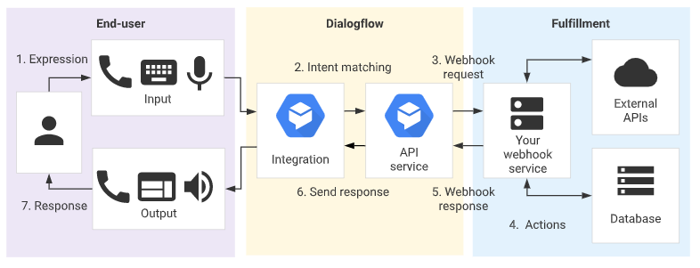

# Dialogflow Chatbot for Education platform

## Process Flow

a)	The end-user types or speaks an expression.

b)	Dialogflow matches the end-user expression to an intent and extracts parameters.

c)	Dialogflow sends a webhook request message to your webhook service. This message contains information about       the matched intent, the action, the parameters, and the response defined for the intent.

d)	Your service performs actions as needed, like database queries or external API calls.

e)	Your service sends a webhook response message to Dialogflow. This message contains the response that should be     sent to the end-user.

f)	Dialogflow sends the response to the end-user.

g)	The end-user sees or hears the response.

